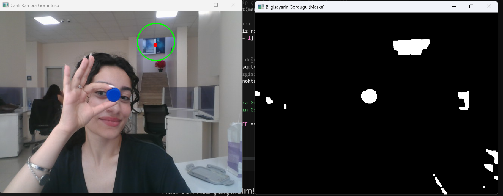
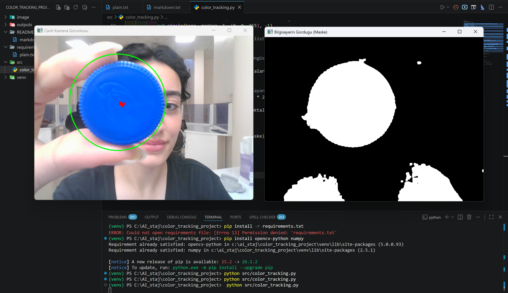

# Canlı Kamera Üzerinden Renk Tabanlı Nesne Takibi

Bu proje, Python ve OpenCV kullanarak belirli bir renkteki (örneğin mavi) nesneleri canlı kamera görüntüsü veya statik resimler üzerinden gerçek zamanlı olarak takip etmeyi amaçlar.

## 🚀 Kullanılan Teknolojiler & Teknikler
* **HSV Renk Uzayı:** Işık değişimlerinden etkilenmeden renk tespiti.
* **Maskeleme (Thresholding):** Hedef rengi arka plandan ayırma.
* **Morfolojik İşlemler:** Görüntüdeki gürültüleri (lekeleri) temizleme.
* **Görüntü Momentleri:** Nesnenin kütle merkezini ($X, Y$) hesaplama.

## 🛠️ Kurulum
```bash
pip install -r requirements.txt

Bu Proje Tam Olarak Neyi Amaçlıyor? 
"Bilgisayara karmaşık, renkli ve gürültülü bir dünyadan, sadece ilgilendiği nesneyi ayıklamayı öğretmektir."
İnsan gözü odaya baktığında masayı, duvarı, senin yüzünü ve elindeki mavi kalemi saniyede ayırt eder. Bilgisayar ise sadece milyonlarca sayı dizisi (piksel) görür. Bu proje bilgisayara şu 3 komutu verir:
1."Dünyayı basitleştir:" Parlaklık ve gölge değişimlerinden etkilenmemek için görüntüyü renk uzayına (HSV) çevir.
2."Gözünü sadece hedefe dik:" Seçtiğin renk dışındaki tüm dünyayı (duvarları, insanları) simsiyah yap; hedef nesneyi ise bembeyaz bir silüet olarak bırak (Maskeleme).
3."Koordinatları yakala:" O beyaz silüetin tam matematiksel orta noktasını ($X, Y$ koordinatı olarak) hesapla ve o koordinata bir hedef çizgisi çiz.

##Yapacağımız İşlemlerin Mantığı
[1. Kameradan Kare Al] ➔ [2. BGR'dan HSV'ye Çevir] ➔ [3. Renk Maskesi Uygula] ➔ [4. Morfolojik Temizlik] ➔ [5. Kontur & Moment bul] ➔ [6. Ekrana Çiz]

##Neden BGR değil de HSV?
Normalde OpenCV resimleri BGR (Blue, Green, Red) olarak okur. Ancak gerçek hayatta odanın ışığı biraz değiştiğinde, sarı bir objenin BGR değerleri tamamen altüst olur. Bilgisayar onu tanıyamaz hale gelir.

HSV (Hue, Saturation, Value): Rengi ışık gücünden ayırır.
Hue (Öz): Rengin kendisidir (Kırmızı, Mavi, Sarı vb.). Işık azalsa da artsa da bu değer neredeyse sabit kalır.
Saturation (Doygunluk): Rengin ne kadar canlı veya soluk olduğudur.
Value (Parlaklık): Işığın miktarıdır.

Bizim Yapacağımız İşlem: Resmi HSV'ye çevirip "Bana sadece şu Hue (renk) aralığındaki pikselleri getir, ışığı önemli değil" diyeceğiz.

### 1. Uzaktan Takip ve Alan Algılama Mantığı
Nesne uzaktayken ve ekranda daha büyük başka bir mavi alan (örneğin arkadaki pano) varken, sistem en büyük alana kilitlenir:



### 2. Yakından Takip ve Hedefe Kilitlenme
Mavi nesne kameraya yaklaştırılıp ekrandaki en büyük alan haline geldiğinde, bilgisayar anında hedefi günceller ve nesnenin merkezine kilitlenir:

